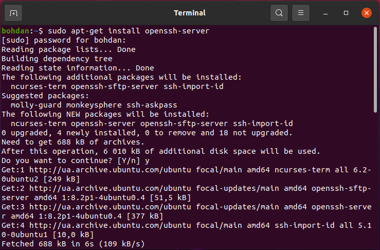
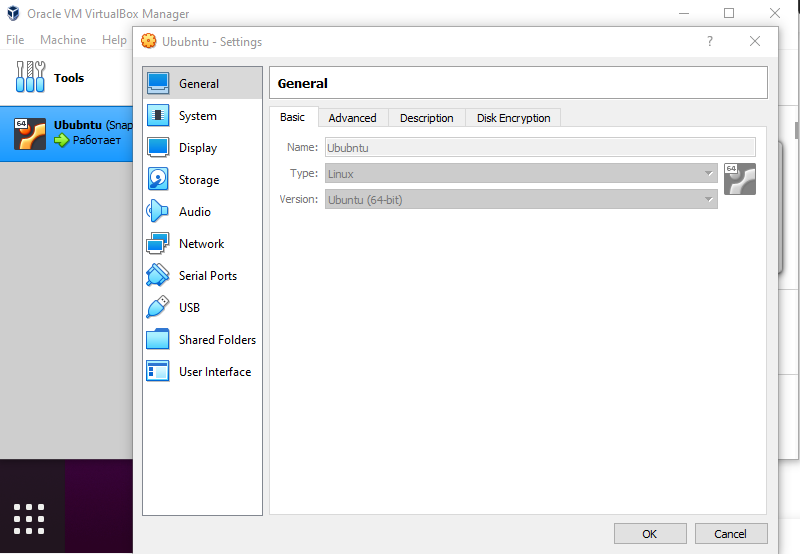
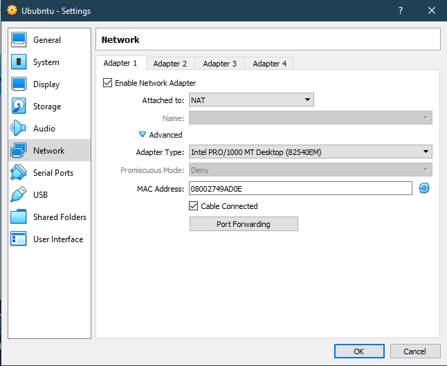
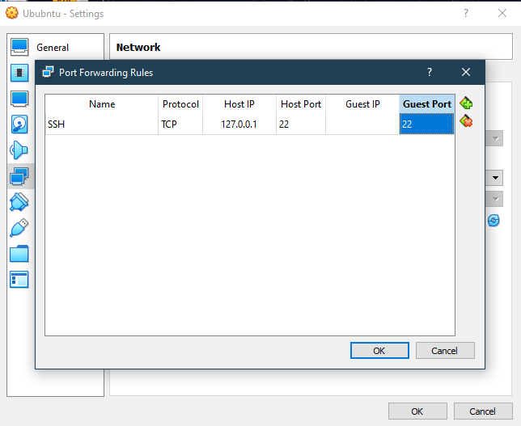
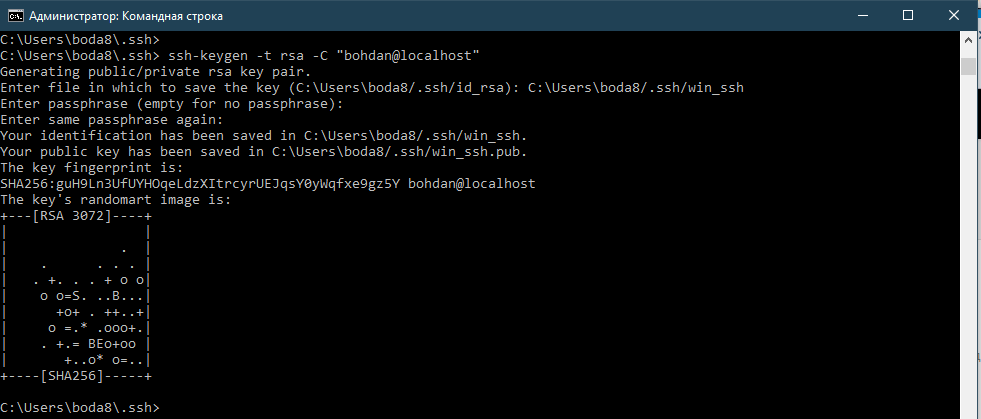
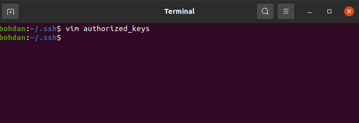

## Install openssh-server
</img>
## Add port forwarding rule
</img>
</img>
</img>
## Generate a new SSH Key
</img>
## Add .pub file generated on the previous step to ~/.ssh/authorized_key
</img>
## Try to login into server
</img>
## Change port to 2222
</img>
## Try to login into server
</img>

## SSH port forwarding (SSH tunneling)
Local port forwarding allows you to forward a port on the local (ssh client) machine to a port on the remote (ssh server) machine, which is then forwarded to a port on the destination machine.
In this forwarding type, the SSH client listens on a given port and tunnels any connection to that port to the specified port on the remote SSH server, which then connects to a port on the destination machine. The destination machine can be the remote SSH server or any other machine.
Local port forwarding is mostly used to connect to a remote service on an internal network such as a database or VNC server.

In Linux, macOS, and other Unix systems, to create a local port forwarding, pass the -L option to the ssh client:
```
ssh -L [LOCAL_IP:]LOCAL_PORT:DESTINATION:DESTINATION_PORT [USER@]SSH_SERVER
```
The options used are as follows:

[LOCAL_IP:]LOCAL_PORT - The local machine IP address and port number. When LOCAL_IP is omitted, the ssh client binds on the localhost.
DESTINATION:DESTINATION_PORT - The IP or hostname and the port of the destination machine.
[USER@]SERVER_IP - The remote SSH user and server IP address.
You can use any port number greater than 1024 as a LOCAL_PORT. Ports numbers less than 1024 are privileged ports and can be used only by root. If your SSH server is listening on a port other than 22 (the default), use the -p [PORT_NUMBER] option.

The destination hostname must be resolvable from the SSH server.

Let’s say you have a MySQL database server running on machine db001.host on an internal (private) network, on port 3306, which is accessible from the machine pub001.host, and you want to connect using your local machine MySQL client to the database server. To do so, you can forward the connection using the following command:
```
ssh -L 3336:db001.host:3306 user@pub001.host
```
Now, if you point your local machine database client to 127.0.0.1:3336, the connection will be forwarded to the db001.host:3306 MySQL server through the pub001.host machine that acts as an intermediate server.

You can forward multiple ports to multiple destinations in a single ssh command. For example, you have another MySQL database server running on machine db002.host, and you want to connect to both servers from your local client, you would run:
```
ssh -L 3336:db001.host:3306 3337:db002.host:3306 user@pub001.host
```
