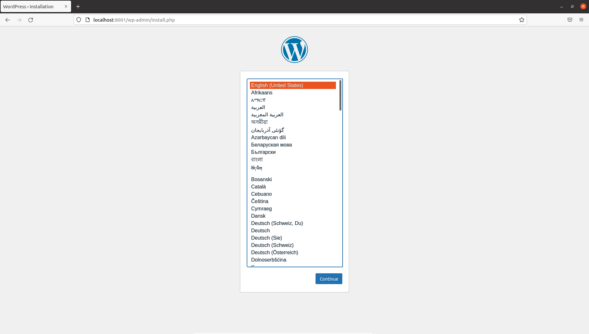
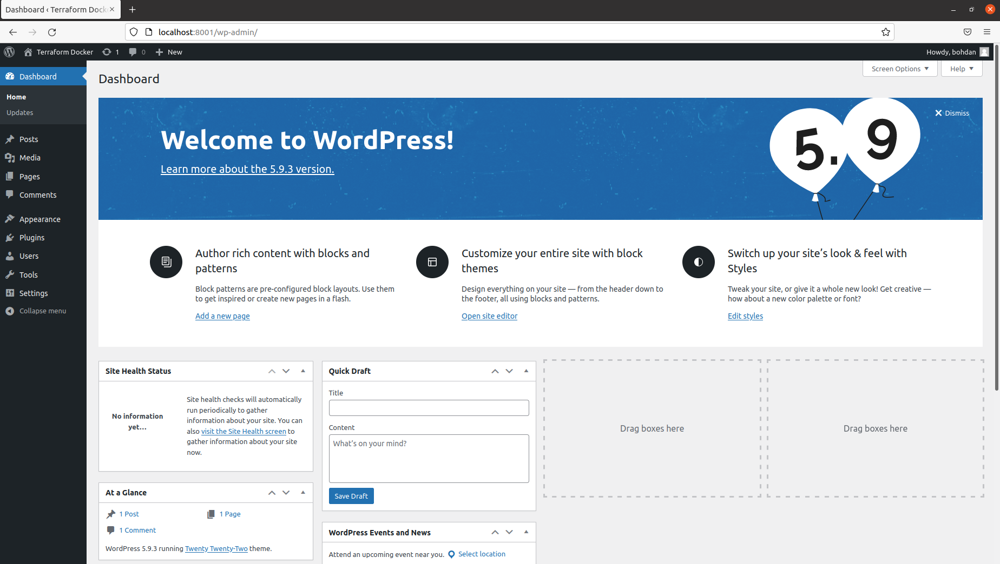
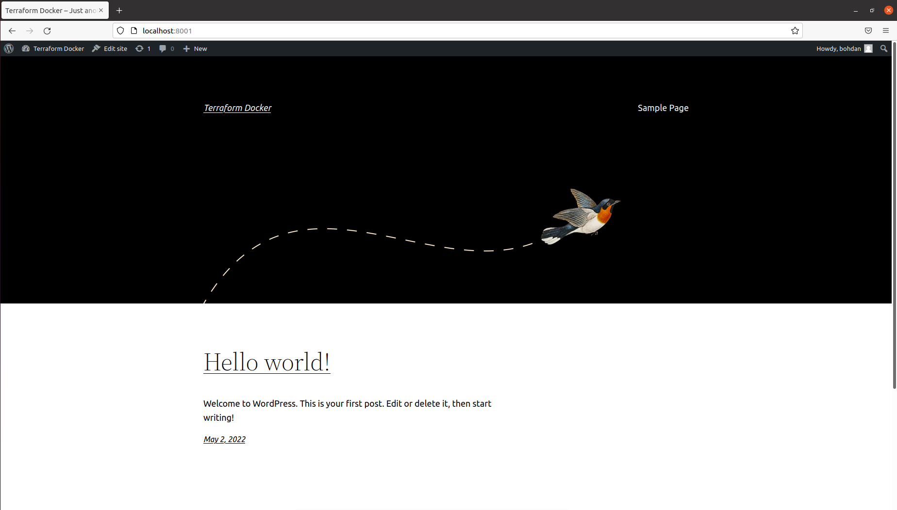

## Install Terraform
```
sudo apt-get update && sudo apt-get install -y gnupg software-properties-common curl

curl -fsSL https://apt.releases.hashicorp.com/gpg | sudo apt-key add -

sudo apt-add-repository "deb [arch=amd64] https://apt.releases.hashicorp.com $(lsb_release -cs) main"

sudo apt-get update && sudo apt-get install terraform
```

## Verify the installation
```
terraform -v
```
Output:
```
Terraform v1.1.9
on linux_amd64
```

## Initialization of Terraform
```
terraform init
```
Output:
```
Initializing modules...

Initializing the backend...

Initializing provider plugins...
- Finding latest version of kreuzwerker/docker...
- Installing kreuzwerker/docker v2.16.0...
- Installed kreuzwerker/docker v2.16.0 (self-signed, key ID BD080C4571C6104C)

Partner and community providers are signed by their developers.
If you'd like to know more about provider signing, you can read about it here:
https://www.terraform.io/docs/cli/plugins/signing.html

Terraform has created a lock file .terraform.lock.hcl to record the provider
selections it made above. Include this file in your version control repository
so that Terraform can guarantee to make the same selections by default when
you run "terraform init" in the future.

Terraform has been successfully initialized!

You may now begin working with Terraform. Try running "terraform plan" to see
any changes that are required for your infrastructure. All Terraform commands
should now work.

If you ever set or change modules or backend configuration for Terraform,
rerun this command to reinitialize your working directory. If you forget, other
commands will detect it and remind you to do so if necessary.
```

## Create resources
```
terraform apply
```
Output:
```
Terraform used the selected providers to generate the following execution plan. Resource actions are indicated with the following symbols:
  + create

Terraform will perform the following actions:

  # module.wordpress.docker_container.mysql will be created
  + resource "docker_container" "mysql" {
      + attach           = false
      + bridge           = (known after apply)
      + command          = (known after apply)
      + container_logs   = (known after apply)
      + entrypoint       = (known after apply)
      + env              = (known after apply)
      + exit_code        = (known after apply)
      + gateway          = (known after apply)
      + hostname         = (known after apply)
      + id               = (known after apply)
      + image            = (known after apply)
      + init             = (known after apply)
      + ip_address       = (known after apply)
      + ip_prefix_length = (known after apply)
      + ipc_mode         = (known after apply)
      + log_driver       = (known after apply)
      + logs             = false
      + must_run         = true
      + name             = "wordpress_mysql"
      + network_data     = (known after apply)
      + read_only        = false
      + remove_volumes   = true
      + restart          = "no"
      + rm               = false
      + security_opts    = (known after apply)
      + shm_size         = (known after apply)
      + start            = true
      + stdin_open       = false
      + tty              = false

      + healthcheck {
          + interval     = (known after apply)
          + retries      = (known after apply)
          + start_period = (known after apply)
          + test         = (known after apply)
          + timeout      = (known after apply)
        }

      + labels {
          + label = (known after apply)
          + value = (known after apply)
        }

      + networks_advanced {
          + aliases = [
              + "net",
            ]
          + name    = "net"
        }
    }

  # module.wordpress.docker_container.wordpress will be created
  + resource "docker_container" "wordpress" {
      + attach           = false
      + bridge           = (known after apply)
      + command          = (known after apply)
      + container_logs   = (known after apply)
      + entrypoint       = (known after apply)
      + env              = (known after apply)
      + exit_code        = (known after apply)
      + gateway          = (known after apply)
      + hostname         = (known after apply)
      + id               = (known after apply)
      + image            = (known after apply)
      + init             = (known after apply)
      + ip_address       = (known after apply)
      + ip_prefix_length = (known after apply)
      + ipc_mode         = (known after apply)
      + log_driver       = (known after apply)
      + logs             = false
      + must_run         = true
      + name             = "wordpress_nginx"
      + network_data     = (known after apply)
      + read_only        = false
      + remove_volumes   = true
      + restart          = "no"
      + rm               = false
      + security_opts    = (known after apply)
      + shm_size         = (known after apply)
      + start            = true
      + stdin_open       = false
      + tty              = false

      + healthcheck {
          + interval     = (known after apply)
          + retries      = (known after apply)
          + start_period = (known after apply)
          + test         = (known after apply)
          + timeout      = (known after apply)
        }

      + labels {
          + label = (known after apply)
          + value = (known after apply)
        }

      + networks_advanced {
          + aliases = [
              + "net",
            ]
          + name    = "net"
        }

      + ports {
          + external = 8001
          + internal = 80
          + ip       = "0.0.0.0"
          + protocol = "tcp"
        }
    }

  # module.wordpress.docker_image.mysql will be created
  + resource "docker_image" "mysql" {
      + id           = (known after apply)
      + keep_locally = false
      + latest       = (known after apply)
      + name         = "kraskobohdan/cloud-tech:wordpress-mysql"
      + output       = (known after apply)
      + repo_digest  = (known after apply)
    }

  # module.wordpress.docker_image.wordpress will be created
  + resource "docker_image" "wordpress" {
      + id           = (known after apply)
      + keep_locally = false
      + latest       = (known after apply)
      + name         = "kraskobohdan/cloud-tech:wordpress-nginx"
      + output       = (known after apply)
      + repo_digest  = (known after apply)
    }

  # module.wordpress.docker_network.private_network will be created
  + resource "docker_network" "private_network" {
      + driver      = (known after apply)
      + id          = (known after apply)
      + internal    = (known after apply)
      + ipam_driver = "default"
      + name        = "net"
      + options     = (known after apply)
      + scope       = (known after apply)

      + ipam_config {
          + aux_address = (known after apply)
          + gateway     = (known after apply)
          + ip_range    = (known after apply)
          + subnet      = (known after apply)
        }
    }

Plan: 5 to add, 0 to change, 0 to destroy.

Do you want to perform these actions?
  Terraform will perform the actions described above.
  Only 'yes' will be accepted to approve.

  Enter a value: yes

module.wordpress.docker_image.mysql: Creating...
module.wordpress.docker_network.private_network: Creating...
module.wordpress.docker_image.wordpress: Creating...
module.wordpress.docker_image.mysql: Creation complete after 2s [id=sha256:e6bd8d27ae6ecd990cd6872786d42c768310e839e1239e2cb75970947907a1c6kraskobohdan/cloud-tech:wordpress-mysql]
module.wordpress.docker_image.wordpress: Creation complete after 2s [id=sha256:331bb6ca4a9fee4603721304399ea35d7ad90a08861be554a8b79be46fd1b2d3kraskobohdan/cloud-tech:wordpress-nginx]
module.wordpress.docker_network.private_network: Creation complete after 4s [id=9e6dbd091c1aebc04d0e787ac249790e4aa4094d812924f583423a748cfd8878]
module.wordpress.docker_container.wordpress: Creating...
module.wordpress.docker_container.mysql: Creating...
module.wordpress.docker_container.wordpress: Creation complete after 6s [id=8fb77af4799d03c25a29128e87f21e054610c8892126bdf644ccb8d7bd2685c8]
module.wordpress.docker_container.mysql: Creation complete after 6s [id=c1846a01882e064e534e104c95185f691f730d5ba6595ea935673d5e1408f721]

Apply complete! Resources: 5 added, 0 changed, 0 destroyed.
```

## Wordpress
 </br>

 </br>

 </br>
